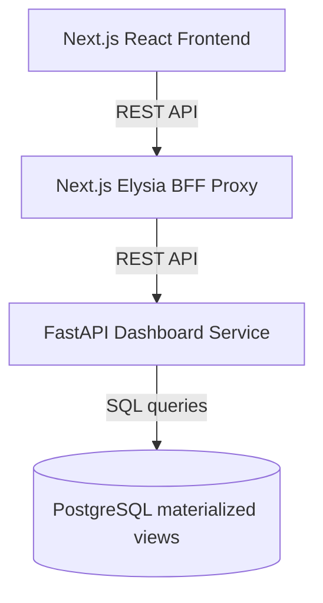

# OAN Dashboards

This project is a Next.js application that serves as the Presentation Layer and Backend-for-Frontend (BFF) for the Farmer Registry Dashboards. 

## Architecture

The application is designed to be highly secure and performant, relying on a microservice architecture where this Next.js app proxies data requests to the `farmer-registry-dashboard-api`.



### Key Responsibilities
- **Frontend State**: Manages filter selections (Region, Zone, Woreda, Record Status, etc.).
- **BFF (Backend-for-Frontend)**: Validates incoming requests and proxies them to the internal Python FastAPI service. Next.js does NOT execute any SQL directly for chart data, mitigating SQL injection risks.
- **Location Filter Seeding**: Queries the local `ati_fp_dashboard` database to populate filter dropdowns.

## Security
- **No Raw SQL**: Chart execution logic is fully delegated to the Python API.
- **Strict Proxies**: The `/api/charts/:chartId` route securely routes sanitized query parameters.

## Development
To run the Next.js server locally:
```bash
npm run dev
```
