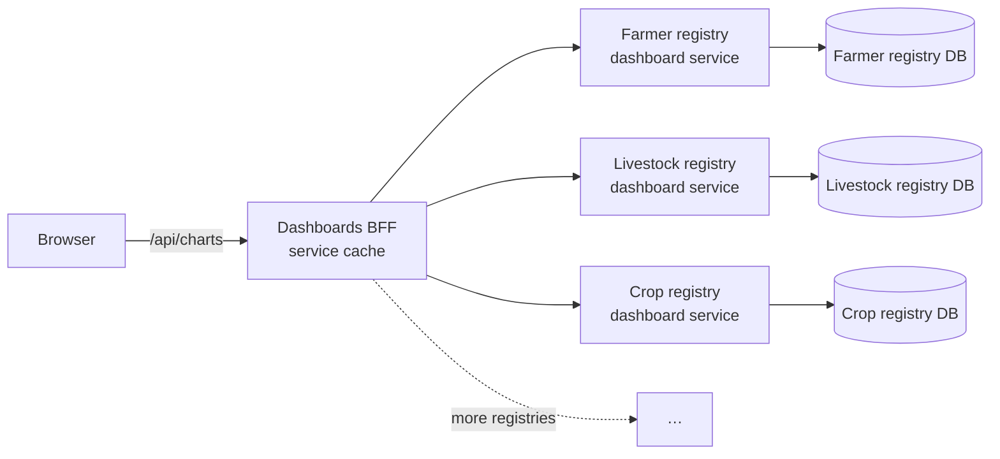

# OAN Dashboards

A web application that gives OpenAgriNet programme staff one screen of analytics per domain:

| Dashboard | What it shows |
| --- | --- |
| **Registries** | Farmer registry overview: registrations, demographics, land tenure, geographic coverage, with region → kebele drill-down on a map. Dedicated crop and livestock views |
| **Catalogs** | National reference data: crops and varieties, livestock breeds, seed demand, administrative hierarchy, connected registries |
| **Access to Credit** | Credit pipeline: loan applications, consent outcomes, providers, products, data sharing |
| **DevOps** | Platform health: instances, pipelines, API traffic, databases, incidents |

It is a Next.js 16 application. The same process serves the React UI and a backend-for-frontend
(BFF) API, built with Elysia and mounted under `/api`.

## Architecture

Each registry publishes its data to the dashboards through its own **dashboard service**. A
dashboard service is a small, read-only API that owns its registry's database access and returns
aggregate chart data over one common HTTP contract. The dashboards BFF talks only to these services
over the private network, caches their responses, and holds no registry database credentials.



**Service status:**

| Service | Status |
| --- | --- |
| Farmer registry dashboard service ([farmer-registry-dashboard-api](https://github.com/Centre-for-Open-Societal-Systems/farmer-registry-dashboard-api)) | In production use |
| Other registries | Will follow the same pattern |

Until then, their dashboards read a transitional dashboard database directly (see
[Architecture](docs/architecture.md#transitional-direct-database-access)).

## Quick start

```bash
cp .env.example .env    # set the dashboard service URLs; never commit real values
npm install
npm run dev             # http://localhost:3000
```

See [Setup and development](docs/setup-and-development.md) for running the dashboard services
locally.

## Documentation

| Document | Contents |
| --- | --- |
| [Architecture](docs/architecture.md) | Dashboard services, BFF, caching, frontend structure, security |
| [Dashboard services](docs/dashboard-services.md) | The service contract, adding a registry, caching behaviour |
| [Registry dashboard](docs/registry-dashboard.md) | Farmer registry charts, filters, freshness, limitations |
| [Data integration](docs/data-integration.md) | Chart routing, filters, response format, adding a chart |
| [Configuration](docs/configuration.md) | Environment variables and secrets |
| [Setup and development](docs/setup-and-development.md) | Local environment and checks |
| [Deployment and operations](docs/deployment.md) | Container image, networking, scaling, monitoring, troubleshooting |
| [AGENTS.md](AGENTS.md) | Rules for contributors and coding agents working in this repository |

## License

MIT. See [LICENSE](LICENSE).
