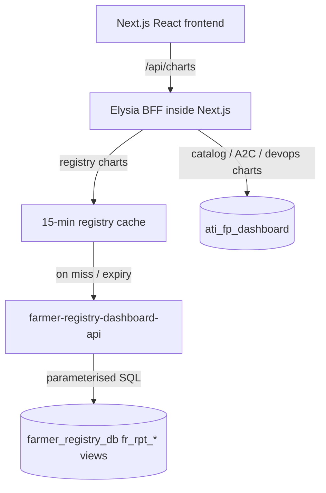

# OAN Dashboards

Next.js application for the OpenAgriNet dashboards: Registries (GEN2 farmer registry), Catalogs,
Access to Credit and DevOps. It is both the presentation layer and the Backend-for-Frontend (BFF).

**Design:** [docs/farmer-registry-dashboard-design.md](docs/farmer-registry-dashboard-design.md) ·
**Contributor / agent guide:** [AGENTS.md](AGENTS.md)

## Architecture



- **Registry charts** come from
  [`farmer-registry-dashboard-api`](https://github.com/Centre-for-Open-Societal-Systems/farmer-registry-dashboard-api).
  The BFF caches each chart and filter combination for 15 minutes (`REGISTRY_CACHE_TTL_SECONDS`).
  It warms the unfiltered view at start-up and keeps serving the last good data if the API is down.
- **Catalog, A2C and DevOps charts** run parameterised SQL against the local `ati_fp_dashboard`
  database.

## Development

```bash
cp .env.example .env
npm install
npm run dev
```

See [docs/setup-and-development.md](docs/setup-and-development.md) for database setup.
