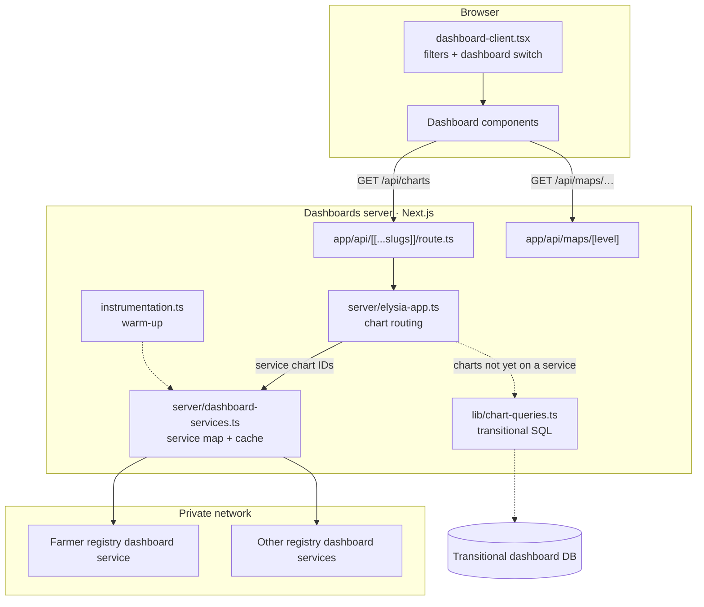

# Architecture

## Principles

1. **One dashboard service per registry.** Each registry (farmer, livestock, crop, …) exposes its
   statistics through its own read-only dashboard service. The service is deployed alongside the
   registry, owns that registry's database access, and returns aggregates only.
2. **The dashboards never touch a registry database.** The BFF knows each service's URL and the chart
   IDs it serves, and nothing else. No registry database credentials are configured here.
3. **One contract for all services.** Every service implements
   `GET /api/v1/charts/<chartId>?<filters>` and returns a JSON array of rows. That is why adding a
   registry needs configuration, not new integration code.
4. **Cache at the edge of the dashboards.** Registry statistics come from reporting views that are
   refreshed on a schedule, so the BFF caches every chart and filter combination and keeps load on
   the registries constant.
5. **The browser talks only to the BFF.** Services are reachable only on the private network.

## Components

| Component | Location | Responsibility |
| --- | --- | --- |
| Page shell | `app/page.tsx`, `components/dashboard-client.tsx` | Filter state and the dashboard switch. Dashboards are loaded with `next/dynamic` |
| BFF | `server/elysia-app.ts`, mounted by `app/api/[[...slugs]]/route.ts` | Parses filters, routes each chart ID, merges batch results |
| Service map and cache | `server/dashboard-services.ts` | `DASHBOARD_SERVICES`: service id, URL variable, accepted filters and chart IDs for each service. Shared response cache |
| Warm-up | `instrumentation.ts` | Pre-loads the unfiltered charts of every configured service at start-up and every cache period |
| Map geometry | `app/api/maps/[level]/route.ts` | Serves region, zone and woreda boundaries (Brotli TopoJSON in `public/maps`) as GeoJSON |
| Registry dashboard services | separate repositories | Read-only aggregate APIs, one per registry |

## Request flow

1. A dashboard component requests a group of charts through
   `useChartGroupData(chartNames, filters)` (`hooks/use-data.ts`). That becomes one request:
   `GET /api/charts?charts=a,b,c&region=ET04&…`.
2. The Elysia `/charts` handler normalises the filters and runs every chart in parallel through
   `executeChartQuery`.
3. For each chart ID:
   - **Served by a dashboard service** (`serviceForChart(id)`): the rows come from the service
     cache, which calls `<service URL>/api/v1/charts/<id>` with that service's filters on a miss or
     after expiry.
   - **Not yet served by a service:** the transitional SQL path runs (see below).
4. The handler returns `{success, data: {<id>: {success, data, error, executionTime}}, summary}`.
   One chart failing does not fail the batch.

## Service cache

Implemented in `server/dashboard-services.ts` with `lru-cache`:

| Property | Behaviour |
| --- | --- |
| Key | service id + chart ID + the filters that service accepts (other filters do not split the cache) |
| TTL | `DASHBOARD_CACHE_TTL_SECONDS` (default 900, minimum 60). Reads do not extend it |
| Stale-while-revalidate | After expiry, callers get the cached rows immediately while one background request refreshes them. Concurrent requests share one call |
| Failure | A failed call (non-2xx, network error, service not configured) is never cached. The last good rows keep being served and a warning is logged |
| Warm-up | The unfiltered view of every chart of every configured service is loaded at start-up and every TTL |
| Scope | One cache per server process, held on `globalThis` so that `instrumentation.ts` and the route handlers (bundled separately) share it |

See [Dashboard services](dashboard-services.md) for the contract and for adding a registry.

## Transitional direct database access

The Catalogs, Access to Credit and DevOps dashboards, and some Registries panels, do not have a
dashboard service yet. For those chart IDs the BFF still runs parameterised SQL templates from
`lib/chart-queries.ts` against a dashboard database (`DATABASE_URL`). This path:

- is kept only until each domain has its dashboard service, and should not be extended
- follows the same safety rules: values bound as parameters, column names from fixed maps
- needs database credentials in the dashboards' environment. The service architecture removes that
  requirement

Moving a chart to a service is described in [Data integration](data-integration.md).

## Frontend

| Area | Location |
| --- | --- |
| Filter sidebar: dashboard selector, cascading Region → Zone → Woreda → Kebele, Farming Type, Record Status, Type of Farmer (Credit Provider for Access to Credit) | `components/global-filters-sidebar.tsx` |
| Registries: overview (default), plus crop and livestock views selected by farming type | `components/farmer-overview-dashboard.tsx`, `crop-sown-dashboard.tsx`, `livestock-dashboard.tsx` |
| Other dashboards | `components/catalogs-dashboard.tsx`, `a2c-dashboard.tsx`, `devops-dashboard.tsx` |
| Registry UI kit and code labels (age bands, tenure) | `components/registry/registry-ui.tsx`, `registry-data.ts` |
| Map, loaded when scrolled into view; clicking applies a geography filter | `components/ethiopia-map.tsx`, `components/lazy/map-when-visible.tsx` |
| Export of the visible panels as PNG, PDF or CSV | `components/registry/export-button.tsx` |
| UI primitives (shadcn/ui on Radix) | `components/ui/*` |

Charts are drawn with Recharts and styled with Tailwind CSS 4.

## Security

- **No registry credentials.** The dashboards hold only service URLs. Each registry's database
  credentials live with its dashboard service.
- **Private services.** Dashboard services have no public ingress and are called only
  server-to-server. The browser only ever calls the same-origin BFF.
- **No SQL from the client.** The browser sends only chart IDs and filter values. Services and the
  transitional SQL path bind every value as a parameter, and an unknown chart ID fails.
- **Aggregates only.** No service returns personal data.
- **Secrets handling.** Configuration comes from the environment. Examples in the repository contain
  no credentials, and values never use the `NEXT_PUBLIC_` prefix (which would expose them to
  browsers).
- **Embedding and access.** `next.config.ts` allows framing (`frame-ancestors *`) so a portal can
  embed the dashboards. Restrict it to the portal's origins in production. The dashboards have no
  login of their own, so control access at the portal or the ingress.
