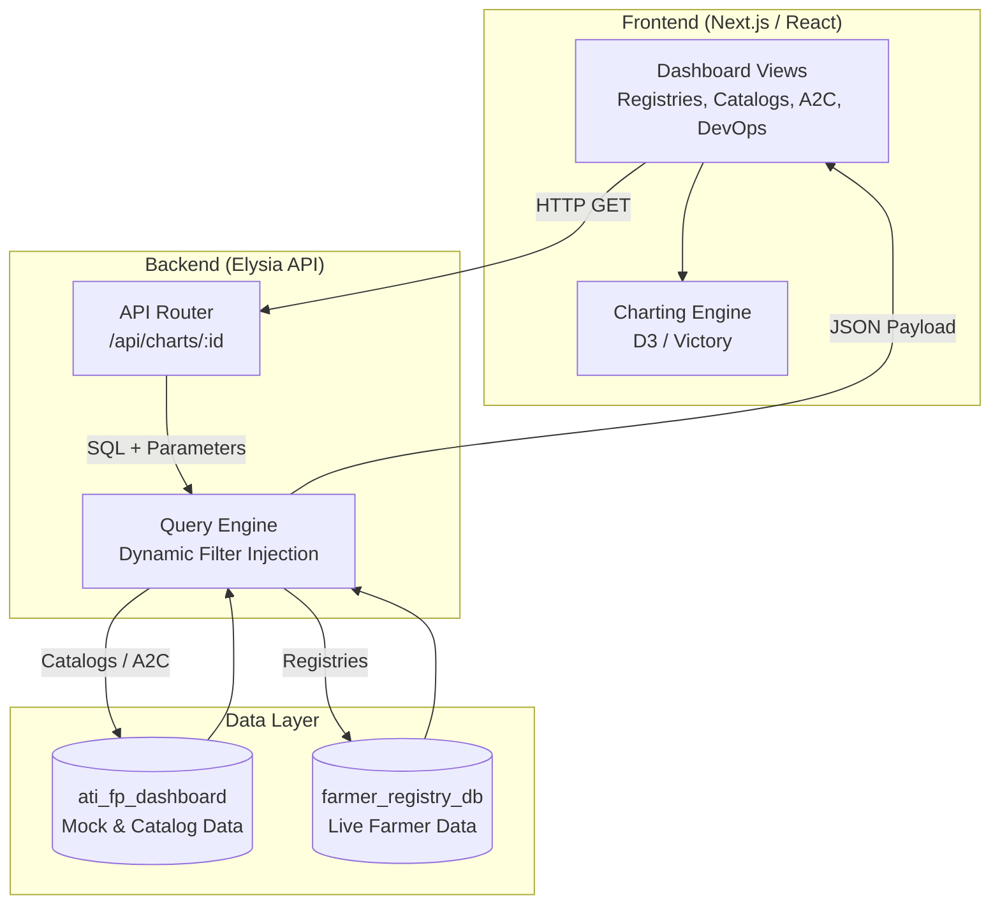

# Architecture Overview

> **Registries (GEN2 farmer registry):** this page describes the older direct-SQL design. The current design (dashboard API, 15-minute cache) is [farmer-registry-dashboard-design.md](farmer-registry-dashboard-design.md).

The `oan_dashboards` application is a high-performance, Next.js-based analytics and visualization dashboard built for the OpenG2P ecosystem. It aggregates and displays agricultural, demographic, and operational data.

## High-Level Architecture

The system is composed of a React-based frontend and an internal Elysia API backend that dynamically routes queries across multiple database pools.

## Core Components

### 1. Frontend Layer
Built with **Next.js 16 (App Router)** and **React**. The UI utilizes a sidebar-based filtering system (Regions, Zones, Woredas, Kebeles) that cascades down to the charting components. The visualizations are rendered client-side based on the unified JSON payloads received from the internal API.

### 2. Elysia API Server
Located in `server/elysia-app.ts`, this lightweight backend runs optimally on modern runtimes (like Bun or Node). 
- **Caching**: Implements a short-lived memory cache (`server/cache.ts`) to prevent database overload from repeated identical dashboard filter queries.
- **Query Resolution**: Maps incoming chart IDs to static SQL queries defined in `lib/chart-queries.ts`.
- **Dynamic Routing**: See [Data Integration](data-integration.md) for details on how it seamlessly routes queries between the local mock database and the live Gen2 registry database.

### 3. Dual Database Architecture
The dashboard is designed to be a unified pane of glass over multiple domains:
- **Local Database (`ati_fp_dashboard`)**: Hosts synthetic data for DevOps monitoring, Access to Credit (A2C), and agricultural catalogs (crops, seeds, livestock).
- **External Gen2 Database (`farmer_registry_db`)**: The live source of truth for the farmer registry, queried directly to ensure real-time accuracy without data duplication.
