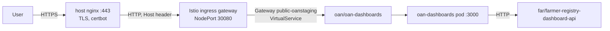

# Deployment and operations

The dashboards run in the `oan` namespace of the OpenG2P clusters. Jenkins builds the image, pushes
it to ECR, and deploys it with the Helm chart in `helm/oan-dashboards`.

| Environment | Branch | Cluster | Public URL | Jenkins kubeconfig credential |
| --- | --- | --- | --- | --- |
| dev | `develop` | gen2 dev (RKE2, API `https://10.0.1.166:6443`) | https://oan-dashboard-development.oanstaging.com | `oan-dev-kubeconfig` |
| staging | `staging` | staging (`10.0.1.212`) | https://oan-dashboard.oanstaging.com | `oan-staging-kubeconfig` |

Other branches and pull requests build and push the image but do not deploy.

## Topology



- **Exposure.** Only the dashboards are public. The registry dashboard services stay `ClusterIP`,
  and the dashboards call them server-to-server
  (`FARMER_REGISTRY_DASHBOARD_API_URL=http://farmer-registry-dashboard-api.far`).
- **Transitional database.** Without `DATABASE_URL`, `/api/config` offers only the Registries
  dashboard. Catalogs, Access to Credit and DevOps stay hidden until they have dashboard services,
  or until the transitional database is provided.

## Container image

`Dockerfile` builds a Next.js **standalone** server:

1. `npm ci` from `package-lock.json`.
2. `next build`, which type-checks and fails on any type error.
3. A `node:20-slim` runtime that runs `node server.js` on port 3000 as the unprivileged `node`
   user.

Nothing environment-specific is baked into the image, and `.dockerignore` keeps `.env` files out of
the build context. The chart runs the container with a read-only root filesystem: `.next/cache` and
`/tmp` are `emptyDir` volumes, all capabilities are dropped, and privilege escalation is off.

## Helm chart (`helm/oan-dashboards`)

| Value | Default | Purpose |
| --- | --- | --- |
| `image.repository`, `image.tag` | — (required) | Set by CI |
| `dashboardServices` | `FARMER_REGISTRY_DASHBOARD_API_URL: http://farmer-registry-dashboard-api.far` | One URL variable per registry dashboard service |
| `cacheTtlSeconds` | `900` | `DASHBOARD_CACHE_TTL_SECONDS` |
| `env`, `envFrom` | empty | Extra variables. Supply `DATABASE_URL` from a Secret via `envFrom` to enable the transitional dashboards |
| `ingress.public` | disabled | `enabled`, `host`, `gatewayName` (default `public-oanstaging`). Creates a Gateway (port 8080, HTTP2, selector `istio: ingressgateway`) and a VirtualService for the host |
| `ingress.private` | disabled | A VirtualService on an existing private gateway in the namespace |
| `replicas`, `resources` | 1; 100m / 256Mi request, 768Mi limit | |

Probes: readiness and liveness on `GET /api/health`.

## Jenkins pipeline (`Jenkinsfile`)

| Stage | Where | What it does |
| --- | --- | --- |
| Checkout | any agent | `checkout scm` |
| ECR Login | any agent | `aws ecr get-login-password` with credential `aws-ecr-creds` |
| Build & Push | any agent | Builds the image and pushes `<commit sha12>`. `develop` and `staging` also move a tag of their own name |
| Stash chart | any agent | Stashes `helm/oan-dashboards` for the deploy agent |
| Deploy (oan namespace) | `vpn-agent2`, `develop`/`staging` only | `helm upgrade --install oan-dashboards` in `oan` with the image and the environment's public host, `--wait`; `kubectl rollout status`; then a **smoke test** |

**Smoke test.** From inside the new pod, the pipeline calls `/api/health` and loads five farmer
charts through the Service. It fails the build if any chart fails. A freshly started pod has an
empty cache, so this proves the dashboards can reach the farmer registry dashboard service.

## Setting up the Jenkins job

Once per Jenkins instance:

1. **New Item → Multibranch Pipeline**, named `oan-dashboards`.
2. **Branch source:** GitHub, repository
   `Centre-for-Open-Societal-Systems/oan_dashboards`, using the same GitHub credential as the
   farmer-registry job. Behaviours: discover branches, and pull requests from origin and forks.
3. **Build configuration:** by Jenkinsfile, script path `Jenkinsfile`.
4. **Scan triggers:** a GitHub webhook (`https://<jenkins>/github-webhook/`, push and pull request
   events). Optionally, also a periodic scan every few hours as a fallback.
5. **Environment:** set `AWS_ACCOUNT_ID` for the job, as for farmer-registry. For example, with the
   Folder Properties or Environment Injector plugin, or as a global property.
6. **Credentials** (Manage Jenkins → Credentials):
   - `aws-ecr-creds`: already exists; reused.
   - `oan-dev-kubeconfig` and `oan-staging-kubeconfig`: **Secret file** credentials, built in
     [Cluster bootstrap](#cluster-bootstrap-once-per-cluster).
7. **Agents:** the deploy stage runs on the node labelled `vpn-agent2`, the only one with access to
   the cluster APIs. It needs `helm` and `kubectl`, as for farmer-registry.

## One-time prerequisites

### ECR repository

Create the ECR repository `openg2p/oan-dashboards` in `ap-south-1`, with mutable tags. The IAM
user behind `aws-ecr-creds` must be able to push to it, and the cluster nodes' IAM role must be able
to pull from it (the same as for `openg2p/farmer-registry/*`).

### Cluster bootstrap (once per cluster)

Jenkins deploys as the namespace-scoped ServiceAccount `oan:oan-ci`, so a cluster admin creates the
namespace and that identity first. On the cluster node:

```sh
export AWS_ACCOUNT_ID=<ECR account id>
envsubst '${AWS_ACCOUNT_ID}' < deploy/k8s/oan-bootstrap.yaml \
  | sudo KUBECONFIG=/etc/rancher/rke2/rke2.yaml kubectl apply -f -
sudo KUBECONFIG=/etc/rancher/rke2/rke2.yaml \
  kubectl -n oan create job --from=cronjob/ecr-creds-refresh ecr-creds-init   # first pull secret now
```

This creates, in `oan`:
- the CI ServiceAccount `oan-ci`, with namespace `admin` and Istio rights
- the ECR pull secret `oan-ecr`, refreshed every 8 hours and attached to the `default`
  ServiceAccount

It follows the same pattern as `far`, `crop` and `live`.

Build the kubeconfig for Jenkins from the `oan-ci` token:

```sh
export KUBECONFIG=/etc/rancher/rke2/rke2.yaml
SERVER=https://10.0.1.166:6443          # staging: its own API server address
kubectl -n oan get secret oan-ci-token -o jsonpath='{.data.ca\.crt}' | base64 -d > /tmp/oan-ca.crt
TOKEN=$(kubectl -n oan get secret oan-ci-token -o jsonpath='{.data.token}' | base64 -d)
KC=/tmp/oan-ci-kubeconfig.yaml
kubectl config --kubeconfig=$KC set-cluster oan --server=$SERVER --certificate-authority=/tmp/oan-ca.crt --embed-certs=true
kubectl config --kubeconfig=$KC set-credentials oan-ci --token="$TOKEN"
kubectl config --kubeconfig=$KC set-context oan --cluster=oan --user=oan-ci --namespace=oan
kubectl config --kubeconfig=$KC use-context oan
kubectl --kubeconfig=$KC auth can-i create deployments -n oan      # yes
kubectl --kubeconfig=$KC auth can-i create gateways.networking.istio.io -n oan   # yes
```

Upload `$KC` to Jenkins as the Secret-file credential (`oan-dev-kubeconfig` or
`oan-staging-kubeconfig`), then delete `/tmp/oan-ca.crt` and `$KC`.

Optionally, move the namespace into a Rancher project, as the other namespaces are, for visibility
in the Rancher UI.

### Public hostname (once per environment)

The host's nginx terminates TLS for every `*.oanstaging.com` site and forwards to the Istio
ingress. For a new hostname:

1. **DNS:** create an A record
   - `oan-dashboard-development.oanstaging.com` → `65.2.237.75` (dev)
   - `oan-dashboard.oanstaging.com` → `43.204.29.27` (staging)
2. **nginx and certificate,** on the cluster node, from `deploy/nginx/oan-dashboard.conf.template`:

   ```sh
   HOST=oan-dashboard-development.oanstaging.com
   sed "s/__HOST__/$HOST/g" deploy/nginx/oan-dashboard.conf.template \
     | sudo tee /etc/nginx/sites-available/openg2p-public-oan-dashboard.conf >/dev/null
   # Enable only the port-80 server first: the 443 server needs the certificate.
   sudo sed -n '1,/^}/p' /etc/nginx/sites-available/openg2p-public-oan-dashboard.conf \
     | sudo tee /etc/nginx/sites-enabled/openg2p-public-oan-dashboard.conf >/dev/null
   sudo nginx -t && sudo systemctl reload nginx
   sudo certbot certonly --webroot -w /var/www/acme -d $HOST
   # Now enable the full site (80 + 443).
   sudo ln -sf /etc/nginx/sites-available/openg2p-public-oan-dashboard.conf \
     /etc/nginx/sites-enabled/openg2p-public-oan-dashboard.conf
   sudo nginx -t && sudo systemctl reload nginx
   ```

   The certbot timer already on the box renews the certificate.
3. **Routing:** the chart's Gateway and VirtualService, created by the first deploy, route the host
   to the dashboards.

## First deploy checklist

1. The farmer registry dashboard service is deployed in `far` (farmer-registry pipeline).
2. ECR repository `openg2p/oan-dashboards` exists.
3. Cluster bootstrap is applied, and the `oan-dev-kubeconfig` credential is uploaded.
4. DNS, nginx and the certificate are set up for the public hostname.
5. The Jenkins job has been created; push to `develop` or re-run the job.
6. Check: `https://oan-dashboard-development.oanstaging.com` loads, and
   `/api/charts?charts=farmerKpis` returns `summary.failed = 0`.

## Scaling and load

- **Load on the dashboard services:** each replica keeps its own service cache. With *N* replicas,
  each service gets at most *N* calls per chart and filter combination per cache period, plus the
  periodic warm-up of its unfiltered charts. Load does not grow with the number of viewers.
- **Memory:** the map boundaries are decoded per request. The 768Mi limit leaves headroom for that.

## Monitoring

| Signal | How | Expected |
| --- | --- | --- |
| Liveness | `GET /api/health` | `{"status":"ok"}` |
| Registry data | `GET /api/charts?charts=farmerKpis` | `summary.failed = 0`; `executionTime` about 0 ms once warm |
| Dashboard service availability | pod logs starting `[dashboard-services]` | None. Repeated `refresh failed` lines point to a service or its database |
| Offered dashboards | `GET /api/config` | `["registries"]` without the transitional database |

## Troubleshooting

| Symptom | Likely cause | Action |
| --- | --- | --- |
| Deploy stage: `forbidden` | Kubeconfig credential missing, wrong, or for another namespace | Rebuild it from `oan-ci-token` and check with `auth can-i` |
| Pod `ImagePullBackOff` | `oan-ecr` missing or expired, or ECR repository missing | `kubectl -n oan get secret oan-ecr`; run the refresher job by hand; check the repository exists |
| Smoke test: `charts failed: … No data` or `refresh failed` | The dashboards cannot reach the farmer registry dashboard service | `kubectl -n far get deploy farmer-registry-dashboard-api`; from the pod, `node -e "fetch('http://farmer-registry-dashboard-api.far/health').then(r=>console.log(r.status))"` |
| Public URL: 404 from Istio | Gateway or VirtualService missing, or host mismatch | `kubectl -n oan get gateway,virtualservice`; the host must equal `ingress.public.host` |
| Public URL: TLS error or nginx default page | nginx site or certificate missing | Complete [Public hostname](#public-hostname-once-per-environment) |
| Filters empty | `/api/filter-options` failing | Check pod logs. Regions come from the bundled boundaries; record statuses come from the farmer registry service |
| Figures lag the registry | Reporting-view refresh interval plus the cache period | Wait, or restart the deployment to clear the cache |
