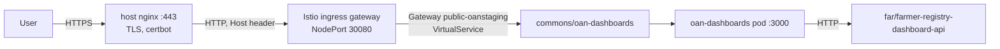

# Deployment and operations

The dashboards run in the shared `commons` namespace of the OpenG2P clusters, next to the platform
services. Jenkins builds the image, pushes it to ECR, and deploys it with the Helm chart in
`helm/oan-dashboards`. The release owns everything it needs in the namespace, including its ECR
pull secret. The only one-time cluster step is the deploy permission
([Deploy permission](#deploy-permission-once-per-cluster)).

| Environment | Branch | Cluster | Public URL | Jenkins kubeconfig credential |
| --- | --- | --- | --- | --- |
| dev | `develop` | gen2 dev (RKE2, API `https://10.0.1.166:6443`) | https://oan-dashboard-development.oanstaging.com | `gen2-dev-kubeconfig` |
| staging | `staging` | staging (`10.0.1.212`) | https://oan-dashboard.oanstaging.com | `staging-farmer-kubeconfig` |

The kubeconfig credentials are the farmer registry's: both are for the `far:farmer-ci`
ServiceAccount. Other branches and pull requests build and push the image but do not deploy.

## Topology



- **Exposure.** Only the dashboards are public. The registry dashboard services stay `ClusterIP`,
  and the dashboards call them server-to-server
  (`FARMER_REGISTRY_DASHBOARD_API_URL=http://farmer-registry-dashboard-api.far`).
- **Transitional database.** Without `DATABASE_URL`, `/api/config` offers only the Registries
  dashboard. Catalogs, Access to Credit and DevOps stay hidden until they have dashboard services,
  or until the transitional database is provided.

## Container image

`Dockerfile` builds a Next.js **standalone** server:

1. `npm ci` from `package-lock.json`.
2. `next build`, which type-checks and fails on any type error.
3. A `node:20-slim` runtime that runs `node server.js` on port 3000 as the unprivileged `node`
   user.

Nothing environment-specific is baked into the image, and `.dockerignore` keeps `.env` files out of
the build context. The chart runs the container with a read-only root filesystem: `.next/cache` and
`/tmp` are `emptyDir` volumes, all capabilities are dropped, and privilege escalation is off.

## Helm chart (`helm/oan-dashboards`)

| Value | Default | Purpose |
| --- | --- | --- |
| `image.repository`, `image.tag` | — (required) | Set by CI |
| `dashboardServices` | `FARMER_REGISTRY_DASHBOARD_API_URL: http://farmer-registry-dashboard-api.far` | One URL variable per registry dashboard service |
| `cacheTtlSeconds` | `900` | `DASHBOARD_CACHE_TTL_SECONDS` |
| `env`, `envFrom` | empty | Extra variables. Supply `DATABASE_URL` from a Secret via `envFrom` to enable the transitional dashboards |
| `ingress.public` | disabled | `enabled`, `host`, `gatewayName` (default `public-oanstaging`). Creates a Gateway (port 8080, HTTP2, selector `istio: ingressgateway`) and a VirtualService for the host |
| `ingress.private` | disabled | A VirtualService on an existing private gateway in the namespace |
| `ecrPullSecret` | enabled, secret `oan-dashboards-ecr` | ECR pull secret owned by the release. `registry` defaults to the host of `image.repository` |
| `imagePullSecrets` | empty | Further pull secrets |
| `replicas`, `resources` | 1; 100m / 256Mi request, 768Mi limit | |

Probes: readiness and liveness on `GET /api/health`.

Besides the Deployment, Service and routing, the release creates:

- **ServiceAccount `oan-dashboards`** for the pod, with no API token mounted. The namespace's
  shared `default` ServiceAccount is not touched.
- **ECR pull secret `oan-dashboards-ecr`.** ECR tokens expire after 12 hours, so the release keeps
  the secret current itself:
  - A `pre-install,pre-upgrade` hook Job (`oan-dashboards-ecr-refresh-init`) writes the secret
    before the pod is created or rolled. The first deploy therefore pulls without any manual step.
  - A CronJob (`oan-dashboards-ecr-refresh`) refreshes it every 8 hours.
  - Both fetch the token with the node's IAM role (`aws ecr get-login-password`), the same as the
    registry namespaces. Their Role can write only this one secret.

All names start with the release name, so nothing collides with the `commons` platform release.

## Jenkins pipeline (`Jenkinsfile`)

| Stage | Where | What it does |
| --- | --- | --- |
| Checkout | any agent | `checkout scm` |
| ECR Login | any agent | `aws ecr get-login-password` with credential `aws-ecr-creds`. Creates the repository `openg2p/oan-dashboards` (scan on push) if it does not exist yet |
| Build & Push | any agent | Builds the image and pushes `<commit sha12>`. `develop` and `staging` also move a tag of their own name |
| Stash chart | any agent | Stashes `helm/oan-dashboards` for the deploy agent |
| Deploy (commons namespace) | `vpn-agent2`, `develop`/`staging` only | `helm upgrade --install oan-dashboards` in `commons` with the image and the environment's public host, `--wait`; `kubectl rollout status`; then a **smoke test** |

**Smoke test.** From inside the new pod, the pipeline calls `/api/health` and loads five farmer
charts through the Service. It fails the build if any chart fails. A freshly started pod has an
empty cache, so this proves the dashboards can reach the farmer registry dashboard service.

## Jenkins job

The job is a **GitHub Organization Folder** at the top level of Jenkins, set up like the registry
folders ("Gen2 application", "oan application").

| Setting | Value |
| --- | --- |
| Item | `OAN-Dashboard`, display name "oan dashboard" |
| Owner | GitHub organization `Centre-for-Open-Societal-Systems`, credential `oan-ci-app` (GitHub App) |
| Repositories | filter by name: `oan_dashboards` |
| Branches | discover branches (all); filter by name: `develop staging` |
| Project recognizer | `Jenkinsfile` |
| Scan | periodically, every 4 hours, plus the organization's GitHub App events |
| Orphaned items | branches deleted in GitHub are removed |

Inside it, Jenkins creates the multibranch project `oan_dashboards`, with one job per branch that
has a `Jenkinsfile`: `develop` (deploys to dev) and `staging` (deploys to staging).

Nothing else is configured on the job:

- `AWS_ACCOUNT_ID` is a global Jenkins variable.
- `aws-ecr-creds`, `gen2-dev-kubeconfig` and `staging-farmer-kubeconfig` already exist and are shared
  with the farmer registry.
- The deploy stage runs on `vpn-agent2`, which has `helm`, `kubectl` and access to both cluster APIs.

To recreate the folder, copy an existing registry folder: **New Item → Organization Folder**, or
`POST /createItem?name=OAN-Dashboard` with that folder's `config.xml`. Then change the repository
filter, the branch filter and the display name as in the table above.

## One-time prerequisites

### ECR repository

The pipeline creates `openg2p/oan-dashboards` in `ap-south-1` on its first build. If the IAM user
behind `aws-ecr-creds` may push but not create repositories, the build stops with a clear message.
Create the repository once by hand in that case. The cluster nodes' IAM role must be able to pull
from it, as for `openg2p/farmer-registry/*`.

### Deploy permission (once per cluster)

Jenkins deploys as `far:farmer-ci`, which initially has rights only in `far` and `crop`. A cluster
admin grants it the same rights in `commons`, on the dev cluster and on staging:

```sh
sudo KUBECONFIG=/etc/rancher/rke2/rke2.yaml kubectl apply -f deploy/k8s/commons-deploy-rbac.yaml
```

This applies namespace-scoped `admin` plus the Istio objects that `admin` does not cover. It is the
only cluster change made outside the pipeline, because farmer-ci cannot grant itself rights. Check
it:

```sh
kubectl auth can-i create deployments -n commons --as=system:serviceaccount:far:farmer-ci             # yes
kubectl auth can-i create gateways.networking.istio.io -n commons --as=system:serviceaccount:far:farmer-ci  # yes
```

### Public hostname (once per environment)

The host's nginx terminates TLS for every `*.oanstaging.com` site and forwards to the Istio
ingress. For a new hostname:

1. **DNS:** create an A record
   - `oan-dashboard-development.oanstaging.com` → `65.2.237.75` (dev)
   - `oan-dashboard.oanstaging.com` → `43.204.29.27` (staging)
2. **nginx and certificate,** on the cluster node, from `deploy/nginx/oan-dashboard.conf.template`:

   ```sh
   HOST=oan-dashboard-development.oanstaging.com
   sed "s/__HOST__/$HOST/g" deploy/nginx/oan-dashboard.conf.template \
     | sudo tee /etc/nginx/sites-available/openg2p-public-oan-dashboard.conf >/dev/null
   # Enable only the port-80 server first: the 443 server needs the certificate.
   sudo sed -n '1,/^}/p' /etc/nginx/sites-available/openg2p-public-oan-dashboard.conf \
     | sudo tee /etc/nginx/sites-enabled/openg2p-public-oan-dashboard.conf >/dev/null
   sudo nginx -t && sudo systemctl reload nginx
   sudo certbot certonly --webroot -w /var/www/acme -d $HOST
   # Now enable the full site (80 + 443).
   sudo ln -sf /etc/nginx/sites-available/openg2p-public-oan-dashboard.conf \
     /etc/nginx/sites-enabled/openg2p-public-oan-dashboard.conf
   sudo nginx -t && sudo systemctl reload nginx
   ```

   The certbot timer already on the box renews the certificate.
3. **Routing:** the chart's Gateway and VirtualService, created by the first deploy, route the host
   to the dashboards.

## First deploy checklist

1. The farmer registry dashboard service is deployed in `far` (farmer-registry pipeline).
2. `deploy/k8s/commons-deploy-rbac.yaml` is applied on the cluster.
3. DNS, nginx and the certificate are set up for the public hostname.
4. The `Jenkinsfile` is on `develop`. The next scan of the `OAN-Dashboard` folder creates the
   `develop` job, or run **Scan Organization Now**.
5. Check: `https://oan-dashboard-development.oanstaging.com` loads, and
   `/api/charts?charts=farmerKpis` returns `summary.failed = 0`.

## Scaling and load

- **Load on the dashboard services:** each replica keeps its own service cache. With *N* replicas,
  each service gets at most *N* calls per chart and filter combination per cache period, plus the
  periodic warm-up of its unfiltered charts. Load does not grow with the number of viewers.
- **Memory:** the map boundaries are decoded per request. The 768Mi limit leaves headroom for that.

## Monitoring

| Signal | How | Expected |
| --- | --- | --- |
| Liveness | `GET /api/health` | `{"status":"ok"}` |
| Registry data | `GET /api/charts?charts=farmerKpis` | `summary.failed = 0`; `executionTime` about 0 ms once warm |
| Dashboard service availability | pod logs starting `[dashboard-services]` | None. Repeated `refresh failed` lines point to a service or its database |
| Offered dashboards | `GET /api/config` | `["registries"]` without the transitional database |

## Troubleshooting

| Symptom | Likely cause | Action |
| --- | --- | --- |
| Deploy stage: `forbidden` in `commons` | `commons-deploy-rbac.yaml` not applied on that cluster | Apply it, then check with `auth can-i` as `far:farmer-ci` ([Deploy permission](#deploy-permission-once-per-cluster)) |
| Deploy stage: hook `oan-dashboards-ecr-refresh-init` failed | The node's IAM role cannot get an ECR token, or Docker Hub images cannot be pulled | `kubectl -n commons logs job/oan-dashboards-ecr-refresh-init --all-containers` |
| Pod `ImagePullBackOff` | `oan-dashboards-ecr` missing or expired, or the image is missing from ECR | `kubectl -n commons get secret oan-dashboards-ecr`; `kubectl -n commons create job --from=cronjob/oan-dashboards-ecr-refresh ecr-refresh-now`; check the tag exists |
| Smoke test: `charts failed: … No data` or `refresh failed` | The dashboards cannot reach the farmer registry dashboard service | `kubectl -n far get deploy farmer-registry-dashboard-api`; from the pod, `node -e "fetch('http://farmer-registry-dashboard-api.far/health').then(r=>console.log(r.status))"` |
| Public URL: 404 from Istio | Gateway or VirtualService missing, or host mismatch | `kubectl -n commons get gateway,virtualservice`; the host must equal `ingress.public.host` |
| Public URL: TLS error or nginx default page | nginx site or certificate missing | Complete [Public hostname](#public-hostname-once-per-environment) |
| Filters empty | `/api/filter-options` failing | Check pod logs. Regions come from the bundled boundaries; record statuses come from the farmer registry service |
| Figures lag the registry | Reporting-view refresh interval plus the cache period | Wait, or restart the deployment to clear the cache |
