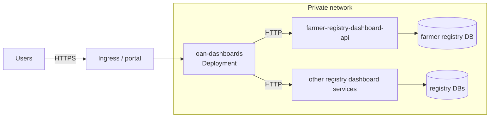

# Deployment and operations

## Container image

The `Dockerfile` has two stages:

1. **Build** (`node:20-slim`): `npm install`, then `npm run build`.
2. **Run** (`oven/bun`): copies `.next`, `public` and `package.json`, installs production
   dependencies, and runs `next start` on port `3000`.

```bash
docker build -t oan-dashboards:<version> .
docker run -d -p 3000:3000 --env-file <secrets-file> oan-dashboards:<version>
```

Supply configuration at runtime from a secret store or an uncommitted env file. The image contains
no configuration.

## Topology



- Only the dashboards are exposed, through the ingress or the embedding portal.
- Dashboard services are `ClusterIP` (or the equivalent) and reachable only from the dashboards.
- Each service holds its own registry's database credentials. The dashboards hold none, apart from
  the transitional `DATABASE_URL` while it is still needed.

## Kubernetes

- **Deployment and Service:** the Service is `ClusterIP`, exposed via the ingress.
- **Probes:** readiness and liveness on `GET /api/health`.
- **Configuration:**
  - ConfigMap: the dashboard service URLs (`*_DASHBOARD_API_URL`) and `DASHBOARD_CACHE_TTL_SECONDS`
  - Secret: the transitional `DATABASE_URL`, if still used
- **Resources:** about `250m` / `512Mi` per replica is a reasonable start. Map geometry is decoded
  per request, so leave memory headroom.
- **Network policy:** allow egress from the dashboards to the dashboard services, and allow ingress
  to the services only from the dashboards.

## Scaling and load

- **Load on the dashboard services:** each dashboards replica keeps its own service cache. With *N*
  replicas, each service receives at most *N* calls per chart and filter combination per cache
  period, plus the periodic warm-up of its unfiltered charts. Load does not grow with the number of
  viewers.
- **Transitional database:** the transitional SQL path is not cached. Size its pool (`lib/config.ts`)
  against the database's connection limit.
- **Shared cache:** a shared cache (for example Redis) can replace the per-process cache if many
  replicas are needed. For typical deployments it is unnecessary.

## Data freshness

A registry figure can lag the registry by the registry's reporting-view refresh interval plus one
dashboards cache period (15 minutes by default). To publish changes sooner, lower
`DASHBOARD_CACHE_TTL_SECONDS` or restart the dashboards.

## Monitoring

| Signal | How | Expected |
| --- | --- | --- |
| Liveness | `GET /api/health` | `{"status":"ok"}` |
| Service data path | `GET /api/charts?charts=farmerKpis` | `summary.failed = 0`; `executionTime` about 0 ms once warm |
| Service availability | logs starting `[dashboard-services]` | None. Repeated `refresh failed` lines point to a service or its database |
| Unconfigured services | start-up log `… is not set; its charts are unavailable` | None in a complete deployment |
| Chart errors | logs starting `Error executing <chart>` | None |

## Troubleshooting

| Symptom | Likely cause | Action |
| --- | --- | --- |
| A registry's panels show errors and the log says `… is not set` | Service URL variable missing | Set the service's `*_DASHBOARD_API_URL` |
| `[dashboard-services] <service>/<chart> refresh failed: fetch failed` | Service down, DNS or network policy, wrong URL | From the dashboards pod, run `curl $FARMER_REGISTRY_DASHBOARD_API_URL/health`. Cached figures keep being served meanwhile |
| `refresh failed: returned 500` | Service or registry database error | Check the service's logs and `/health` |
| Figures do not change after new registrations | The registry's view refresh plus the cache period | Wait, or restart the dashboards to clear the cache |
| Age or tenure panels are empty | Service codes and UI labels out of step | Compare the service's codes with `components/registry/registry-data.ts` |
| Coverage shows 0% | National unit totals not configured on the service | Configure them on the service (`GEO_LEVEL_TOTALS` for the farmer registry) |
| Catalogs, Access to Credit or DevOps panels are empty | Transitional database unreachable or not loaded | Check `DATABASE_URL` and the data |
| Map does not render | `public/maps/*.topojson.br` missing from the image | Rebuild the image, and check that `public/` is copied |
