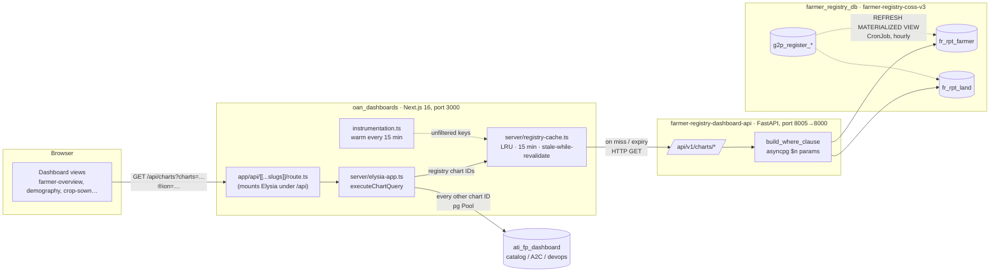

# GEN2 Farmer Registry Dashboard — Design Document

| | |
| --- | --- |
| Jira | G2R-212 — GEN2 Farmer Registry Dashboard |
| Repos | [`Centre-for-Open-Societal-Systems/oan_dashboards`](https://github.com/Centre-for-Open-Societal-Systems/oan_dashboards) (Next.js UI + Elysia BFF), [`Centre-for-Open-Societal-Systems/farmer-registry-dashboard-api`](https://github.com/Centre-for-Open-Societal-Systems/farmer-registry-dashboard-api) (FastAPI data service; supersedes the earlier personal repo `asmitonweb/farmer-registry-dashboard-api`) |
| Data source | `farmer_registry_db` reporting views (`fr_rpt_*`), owned by `farmer-registry-coss-v3` |
| Status | In review. Registry charts come from the API through a 15-minute BFF cache. The high-severity gaps are fixed (§9) |
| Last updated | 2026-09-25 |

This document supersedes the Registries parts of `docs/architecture.md` and
`docs/data-integration.md`. Those files describe the older design, where the Next.js server queried
`g2p_register_farmers` directly through the `GEN2_SCOPE` CTE.

---

## 1. Goal

Show live data from the GEN2 (OpenG2P COSS fork) farmer registry in the OAN dashboards Registries
view. The numbers must stay correct as the registry changes, the dashboard must be cheap to serve,
and it must not be possible to inject SQL through dashboard filters.

### In scope
- Registry KPIs and distributions: totals, gender, farming type, age × gender, education, record
  state, land tenure, monthly registration trend, and geographic coverage.
- Filtering by geography (region → zone → woreda → kebele), farming type, and record state.
- A separate, stateless data service that reads only from the registry's reporting views.
- Caching, because the underlying data only changes on the hourly view refresh.

### Out of scope (for this ticket)
- Catalogs, A2C, and DevOps dashboards. They keep running SQL inside the BFF against
  `ati_fp_dashboard`, which holds synthetic data.
- Writing to the registry, or any per-farmer drill-down or PII view.
- End-user authentication for the dashboards (§7.3).

---

## 2. Background: why a separate API

Earlier, the Registries charts were SQL strings in `lib/chart-queries.ts`, run by the Elysia BFF
inside the Next.js process. They reached GEN2 through the `GEN2_SCOPE` CTE, which unpacked
`geo_code_hierarchy_json` on every query. That design had three problems:

1. **Injection surface.** Filters reached the SQL through `--- DYNAMIC_FILTERS ---` substitution.
   The values were parameterised, but the column names and the database pool were chosen by string
   checks such as `baseQuery.includes('g2p_register_farmers')`. That is easy to break when someone
   edits a query.
2. **Cost.** Unpacking the JSONB for every chart call is slow on a bulk-loaded register.
3. **Schema coupling.** The dashboard had to understand the raw GEN2 tables. `GEN2_SCOPE` also faked
   several columns (`farming_type = 'Mixed Farming'`, `is_farmer = 'yes'`, and so on) to fit the old
   Odoo `res_partner` query shapes.

The registry already publishes **materialized reporting views** built for dashboards
(`farmer-registry-coss-v3/docker/db-seed/reporting_views.sql`). They are country-agnostic, report
areas in hectares, have indexes, and are refreshed on a schedule. A small Python service that reads
only those views fixes all three problems.

---

## 3. Architecture



### 3.1 Components

| Component | Location | Responsibility |
| --- | --- | --- |
| Dashboard UI | `oan_dashboards/components/**`, `hooks/use-data.ts` | Holds filter state and renders charts. Calls only same-origin `/api/*` |
| BFF | `oan_dashboards/server/elysia-app.ts`, mounted by `app/api/[[...slugs]]/route.ts` | Parses filters, routes each chart ID to the cache (registry) or to local SQL, and merges the results |
| Registry cache | `oan_dashboards/server/registry-cache.ts`, `instrumentation.ts` | Holds API responses for 15 minutes, warms the unfiltered view in the background, and serves the last good data if the API is down |
| Dashboard API | `farmer-registry-dashboard-api/app/` | One endpoint per registry chart. Builds a parameterised `WHERE` and queries `fr_rpt_farmer` / `fr_rpt_land` |
| Reporting views | `farmer-registry-coss-v3/docker/db-seed/reporting_views.sql` (+ generated `reporting.yaml`) | Precomputed per-farmer (`fr_rpt_farmer`) and per-parcel (`fr_rpt_land`) rollups |
| View refresh | `farmer-registry-coss-v3/helm/.../reporting-views-refresh.yaml` | CronJob (`analytics.reportingViews.refreshSchedule`, default `0 * * * *`). Refreshes in `pg_depend` order and uses `CONCURRENTLY` |

### 3.2 Request flow (registry chart)

1. The UI calls `GET /api/charts?charts=farmerKpis,farmersByGender&region=ET04`, or
   `/api/charts/<id>` for a single chart.
2. The Elysia handler normalises the query into `ChartFilters`. Missing values become `'all'`.
3. `executeChartQuery(chartName, …)`: if `isRegistryChart(chartName)` is true, it calls
   `getRegistryChart(chartName, filters)`.
4. The cache key is the chart ID plus the sorted API filters that are not `'all'`.
   - **Fresh hit:** rows are returned immediately.
   - **Stale hit:** the old rows are returned immediately, and a single background request refreshes
     the key.
   - **Miss:** one request goes to the API. Concurrent callers for the same key share that request.
5. The API binds the query parameters into `build_where_clause`, which emits `$1..$n`, and runs the
   query on its asyncpg pool.
6. The BFF wraps the rows as `{chartName, success, data, error, executionTime}`, and `/api/charts`
   merges them into `{success, data: {<id>: result}, summary}`. A chart that fails is reported as
   `success: false`, and the other charts in the batch still render.

### 3.3 Routing table

The routing key is the **chart ID**. The list is `REGISTRY_CHARTS` in `server/registry-cache.ts`,
and it is the single source of truth.

| Chart ID | Served by | Notes |
| --- | --- | --- |
| `farmerKpis`, `farmersByRegion`, `farmersByGender`, `farmersByType`, `farmersByAgeAndGender`, `farmersByEducation`, `registryTrendByMonth`, `registryCoverage`, `farmersByRecordState` | Cache → API → `fr_rpt_farmer` | Live GEN2 data |
| `landTenureSplit` | Cache → API → `fr_rpt_land` | Per parcel |
| `farmersByPsnpStatus`, `farmersByImportStatus` | Cache → API (stub) | Always `[]`. GEN2 has no PSNP or import concept yet |
| `catalog*`, `a2c*`, `devops*` | BFF SQL → `ati_fp_dashboard` | Synthetic data; out of scope |
| Remaining legacy registry IDs (`farmersByZone/Woreda/Kebele`, `landStats`, `demographyStats`, `socioEconomicKpis`, `crop*`, `livestock*`, `recentRegistrations`, …) | BFF SQL → `res_partner` in `ati_fp_dashboard` | Still reads the **Odoo mock**, not GEN2 (§9, G-8) |

---

## 4. Data model

### 4.1 `fr_rpt_farmer` (one row per farmer)

The columns the API uses are listed below. See `reporting_views.sql` for the full definition.

| Column | Meaning | Used by |
| --- | --- | --- |
| `farmer_id` | `internal_record_id` (unique index) | every count |
| `geo_1..geo_5`, `geo_1_id..geo_5_id` | Geography unpacked **by position** from `geo_code_hierarchy_json`. `geo_n` is the value mnemonic; `geo_n_id` is the value id (for example `region-ET04`) | filters, `farmersByRegion`, `registryCoverage` |
| `gender` | Enum (`MALE`/`FEMALE`/…) | KPIs, gender split |
| `age`, `age_band` | `age_band` ∈ `UNDER_25, 25_34, 35_49, 50_64, 65_PLUS, UNKNOWN`, defined as policy in the registry's `reporting.yaml` | age × gender |
| `education_level` | Enum | education split |
| `main_farming_type` | Farming type of the largest parcel | type split, `farmingType` filter |
| `total_land_ha`, `owns_any_parcel` | Land rollup, in hectares | KPIs, trend |
| `record_status` | `ACTIVE` / other. **The view does not filter on this**; the API defaults to `ACTIVE` | filters, record-state split |
| `registration_date` | Registration date | monthly trend |

### 4.2 `fr_rpt_land` (one row per parcel)

Any area sliced by a parcel attribute (tenure, land use) comes from here: `land_ownership_type`,
`is_owner_operated`, `land_size_ha`, `farming_type`, `farmer_id`, `record_status` and the same
`geo_n_id` columns. `landTenureSplit` groups this view by tenure, and `registryTrendByMonth` sums
owner-operated parcels here to get `owned_area`.

### 4.3 Freshness

The views are materialized. They refresh hourly by default and after bulk loads (land first, then
farmer). On top of that, the BFF caches each response for up to 15 minutes (§6.1). **In the worst
case, a figure is about 75 minutes behind the source tables.** For an aggregate dashboard this is
acceptable, and it is the reason the cache TTL is kept well below the refresh interval.

---

## 5. API contract — `farmer-registry-dashboard-api`

Base path: `${API_V1_STR}` = `/api/v1`. Every endpoint is `GET /api/v1/charts/<chartId>` and
returns a JSON **array of row objects**. Numbers are JSON numbers (the aggregates are cast in SQL).
`GET /health` runs `SELECT 1` and backs the Docker `HEALTHCHECK`.

### 5.1 Common query parameters

The parameters are shared through the `ChartFilters` dependency (`app/api/filters.py`).

| Param | SQL predicate | Notes |
| --- | --- | --- |
| `region` / `zone` / `woreda` / `kebele` | `geo_n_id = $n OR substr(geo_n_id, strpos(geo_n_id,'-')+1) = $n` | Accepts the bare code (`ET04`) or the full level value id (`region-ET04`). No level names are hard-coded |
| `farmingType` | `LOWER(main_farming_type)` (`farming_type` on the land view) `= LOWER($n)` | The sidebar's `crop`/`livestock`/`mixed` match the enum case-insensitively |
| `recordState` | `LOWER(record_status) = LOWER($n)` | **When absent, only `ACTIVE` records are counted.** `farmersByRecordState` is the exception and sees every status |

A missing value or `all` means no filter. Parameters the API does not know are ignored. The BFF
only forwards the six above, so they are also the only parts of the cache key.

### 5.2 Endpoints and response shapes

| Endpoint | Fields returned | Matches UI? |
| --- | --- | --- |
| `farmerKpis` | `total_farmers, female_farmers, male_farmers, total_land_size, avg_farm_size, household_heads, farmers_with_owned_land, farmers_with_id, farmers_without_id` | ✅ `household_heads` and `farmers_with(out)_id` are still 0 because the views have no source for them |
| `farmersByRegion` | `region, region_code, farmers` | ✅ `region_code` is the bare code |
| `farmersByGender` | `gender, farmers` | ✅ |
| `farmersByType` | `farming_type, farmers` | ✅ |
| `farmersByAgeAndGender` | `age_group, gender, farmers` | ✅ `age_group` is the band code; the UI labels it (`ageBandLabel`) |
| `farmersByEducation` | `education, farmers` | ✅ |
| `landTenureSplit` | `ownership_type, parcels, area` | ✅ enum values; the UI labels them (`tenureLabel`) |
| `registryTrendByMonth` | `period ('YYYY-MM'), farmers, total_area, owned_area` | ✅ |
| `registryCoverage` | `{regions,zones,woredas,kebeles}_{covered,total}` | ✅ `*_total` comes from `GEO_LEVEL_TOTALS`, or `null` when unset |
| `farmersByRecordState` | `record_state, farmers` | ⚠️ the keys match, but the UI buckets `approved/rejected/pending`, which GEN2 does not use (G-17) |
| `farmersByPsnpStatus`, `farmersByImportStatus` | `[]` | stub |

The keys above are pinned by contract tests (`tests/test_charts.py::CONTRACT`).

### 5.3 Errors

A database error returns a FastAPI 500. The BFF cache treats any non-2xx response as a failed
refresh: it keeps the previous rows if it has them and logs `[registry-cache] refresh failed …`.

---

## 6. BFF design — `oan_dashboards`

### 6.1 Caching (`server/registry-cache.ts`)

The data behind the registry charts only changes on the hourly view refresh, so the BFF calls the
API **at most once per TTL for each chart and filter combination**.

- **Store:** `lru-cache` v11 with a `fetchMethod`:
  - `max: 500` entries
  - `ttl = REGISTRY_CACHE_TTL_SECONDS` (default **900**, minimum 60)
  - `allowStale`, `noDeleteOnStaleGet`, `allowStaleOnFetchRejection`
  - `updateAgeOnGet: false`. Reading must not extend an entry's life, or a popular key would never
    refresh. The older `server/cache.ts` makes exactly this mistake.
- **Stale-while-revalidate:** after the TTL, the next read still gets the old rows immediately, and
  exactly one background request refreshes the entry. Concurrent misses for the same key are
  coalesced by `lru-cache`.
- **Failure handling:** a non-2xx response or a network error is thrown, never cached. The last good
  rows keep being served, and the failure is logged. A combination that has never been fetched has
  no fallback, so it reports `success: false`.
- **Warm-up:** `instrumentation.ts` (Next `register()`, Node runtime only) warms the **unfiltered**
  view of every registry chart at boot, then again every TTL (`setInterval(...).unref()`). A
  `globalThis` flag keeps it to one loop under dev hot-reload. The default dashboard therefore never
  waits on the API. Filtered combinations are cached the first time they are requested.
- **One instance per process:** Next bundles `instrumentation.ts` and the route handlers separately,
  so the `LRUCache` lives on `globalThis`. Otherwise the warm-up would fill a cache the routes never
  read.
- **Measured locally:**
  - an unfiltered batch of 12 charts costs about 0–3 ms of BFF time
  - a filtered batch costs about 500 ms on the first request and about 1 ms after that
  - with the API stopped, keys already cached keep serving their last data
- **Scaling note:** the cache is per Next.js process. N replicas make up to N API calls per key per
  TTL. That is fine at this load. If it ever matters, move the cache to Redis or add an HTTP cache in
  front of the API.
- **Invalidation:** none. Restarting the BFF clears the cache, and waiting one TTL picks up new data.
  A manual purge endpoint was left out on purpose, because it would need authentication.

### 6.2 Other notes
- **One route for everything.** `app/api/[[...slugs]]/route.ts` mounts the whole Elysia app on
  `/api` (`runtime = 'nodejs'`, `dynamic = 'force-dynamic'`). `server/elysia.ts` is an unused
  standalone server entry point.
- **Filter parsing is duplicated.** `/charts`, `/charts/:chartId`, `/dashboard-data` and
  `/dashboard/*` each parse filters their own way (`state` vs `recordState`, `provider` or not). A
  new filter has to be added to every one of them.
- **P-code → id conversion** (`convertPcodsToIds`) is skipped for batches that contain only registry
  charts (`convertFiltersFor`).
- **Batch fan-out.** `/api/charts` with no `charts=` runs every entry in `CHART_QUERIES`. The UI
  should always pass `charts=`.

---

## 7. Security

### 7.1 SQL injection
- **API:** every filter value goes through an asyncpg `$n` placeholder. Only literal column names
  and the generated `WHERE` fragment are interpolated. Fixed predicates are passed to
  `build_where_clause(extra=…)` instead of being concatenated onto it. Tests check that injection
  strings are bound as values and never appear in the SQL text.
- **BFF:** the remaining SQL uses `pg` placeholders. `resolveId(table, …)` interpolates a table
  name, but only from literals in the same file.

### 7.2 Network exposure
- The API has **no authentication**. It is designed to be reachable only from the BFF, on the
  compose network or cluster-internal. Never publish it publicly.
- CORS is `ALLOWED_ORIGINS` (default `http://localhost:3000`). This is defence in depth, because
  browsers never call the API directly.
- The BFF reads the API base URL from the server-only `FARMER_API_BASE`. The old
  `NEXT_PUBLIC_FARMER_API_BASE` is still read as a fallback for one release. Remove it from
  deployments, because a `NEXT_PUBLIC_` value is inlined into the browser bundle.

### 7.3 Dashboard access
The dashboards have no login, and `next.config.ts` allows framing from any origin so the host portal
can embed them. Everything served is an aggregate, with no names or IDs. Even so, a count over a
single kebele with narrow filters can identify people. If the dashboards become public, add a
minimum-cell-size (k-anonymity) floor in the API.

---

## 8. Configuration and deployment

### 8.1 Environment

| Service | Variable | Default | Purpose |
| --- | --- | --- | --- |
| API | `DATABASE_URL` | — (required) | `postgresql://…/farmer_registry_db` |
| API | `API_V1_STR` | `/api/v1` | Route prefix |
| API | `ALLOWED_ORIGINS` | `["http://localhost:3000"]` | JSON list |
| API | `GEO_LEVEL_TOTALS` | `{}` (compose: `{"woredas": 1138}`) | National unit counts per level for coverage rates |
| Dashboards | `FARMER_API_BASE` | `http://localhost:8005` | API base URL (server-only) |
| Dashboards | `REGISTRY_CACHE_TTL_SECONDS` | `900` | Cache TTL and warm-up interval |
| Dashboards | `DATABASE_URL` | — | `ati_fp_dashboard` |
| Dashboards | `FARMER_DATABASE_URL` | — | `farmer_registry_db`; only used by leftover direct-SQL code |

### 8.2 Local run

```bash
# 1. Registry stack (owns farmer_registry_db and the fr_rpt_* views; it also builds and runs
#    the dashboard API from ../farmer-registry-dashboard-api as `farmer-registry-dashboard-api`).
cd farmer-registry-coss-v3 && docker compose -p farmer-registry-v3 up -d

# 2. Or run the API on its own, on :8005
cd farmer-registry-dashboard-api && docker compose up -d --build    # or: make dev

# 3. Dashboards on :3000
cd oan_dashboards && npm install && npm run dev
```

### 8.3 Production image
- **API:** two-stage `python:3.11-slim` build, `gunicorn` with 4 `UvicornWorker`s on `:8000`, and a
  `HEALTHCHECK` on `/health`. Each worker opens its own asyncpg pool (default 10 connections), so
  plan for about **40 connections per replica**. The load is low thanks to the BFF cache.
- **Dashboards:** built with Node 20 and run on `oven/bun`.
- Neither repo has CI, a Helm chart, or a Jenkins job yet (G-11).

---

## 9. Known gaps

Severity: **H** = wrong numbers or a broken chart, **M** = correctness or ops risk, **L** = hygiene.

| # | Sev | Problem | Status |
| --- | --- | --- | --- |
| G-1 | H | `registryTrendByMonth` built `{where} AND …`, which is invalid SQL with no filters (500) | ✅ Fixed. Fixed predicates go through `build_where_clause(extra=…)` |
| G-2 | H | API age bands (`UNDER_25…`) vs UI buckets (`0-18…`) left the age charts empty | ✅ Fixed. The UI uses the view's policy bands (`AGE_BANDS`, `ageBandLabel`); the KPIs are now "under 25" and "65+" |
| G-3 | H | Trend `period` was a timestamp and `owned_area` was missing | ✅ Fixed |
| G-4 | M | Coverage hard-coded `woredas_total = 1138` and returned only woredas | ✅ Fixed. Four levels are covered; totals come from `GEO_LEVEL_TOTALS` |
| G-5 | M | Tenure grouped farmer totals by largest-parcel tenure | ✅ Fixed. Now per parcel from `fr_rpt_land`; the UI labels the enum |
| G-6 | M | All record statuses were counted | ✅ Fixed. `ACTIVE` unless `recordState` is given |
| G-7 | M | Geo filter hard-coded `region-`/`zone-`… prefixes | ✅ Fixed. Matches the bare code or the full id |
| G-8 | M | Several Registries-page charts still read the `res_partner` mock | Open. Next step: port `farmersByZone/Woreda/Kebele`, `landStats`, crop/livestock KPIs and `recentRegistrations` |
| G-9 | M | `NEXT_PUBLIC_FARMER_API_BASE` leaked into the client bundle | ✅ Fixed. `FARMER_API_BASE`, with the old name as a one-release fallback |
| G-10 | L | Dead code: `lib/api-client.ts`, unused cache imports | ✅ Removed |
| G-11 | M | No tests, CI or deploy manifests | Partly done. API pytest suite (42 tests: contract, filters, injection) and ruff. CI, Helm and Jenkins are still open |
| G-12 | L | Six `Query(None)` params copied into every endpoint | ✅ `ChartFilters` dependency |
| G-13 | L | `Decimal` aggregates serialised as strings | ✅ Cast in SQL. Per-chart Pydantic response models are still open |
| G-14 | L | FastAPI 0.103 / Pydantic 2.3 pins | Open |
| G-15 | L | Scratch scripts in the repo root | ✅ Removed |
| G-16 | L | Older docs describe the direct-SQL design | ✅ They now point here |
| G-17 | M | The record-state card buckets `approved/rejected/pending/under_review/draft`; GEN2 statuses are `ACTIVE`/… | Open. Needs a product decision on which GEN2 states the card should show |
| G-18 | L | `GEO_LEVEL_TOTALS` is not set in the registry stack's compose service (`farmer-registry-coss-v3`), so coverage % shows 0 there | Open. Add it to that compose service and to the future Helm values |

---

## 10. Testing

**API (`farmer-registry-dashboard-api/tests`, run with `make test`)**
- pytest, pytest-asyncio and httpx `ASGITransport`, against a throw-away Postgres schema holding tiny
  `fr_rpt_farmer`/`fr_rpt_land` tables. The pool's `search_path` points at that schema, and registry
  data is never touched.
- For every chart: a **contract test** that the keys match what the UI reads, a call with no filters,
  and a call with every filter set.
- Behaviour tests:
  - ACTIVE default, and record-state override
  - bare vs prefixed geo codes
  - per-parcel tenure
  - trend with owned area
  - age bands
  - coverage totals from settings
  - injection strings bound as values
  - `/health`
- `build_where_clause` unit tests: placeholder numbering, `extra`, `alias`, view columns.

**Dashboards**
- `npx tsc --noEmit`: the six errors in `components/ui/calendar.tsx` and `resizable.tsx` were there
  before this work. `npm run lint` shows no new findings.
- Manual checks: `/api/charts?charts=<registry ids>` returns `summary.failed = 0` with and without
  filters. A repeat request is served from the cache. Stopping the API still serves cached keys.

---

## 11. Roadmap

1. Review and merge the two PRs (API and dashboards).
2. G-17 (record-state buckets) and G-18 (coverage totals in the registry stack).
3. G-8: port the remaining Registries-page charts to the API.
4. CI for both repos, plus Helm values and a Jenkins job next to the registry chart, following the
   registry's PR-only deploy model.
5. Per-chart Pydantic response models (G-13) and dependency bumps (G-14).

---

## 12. Decision log

| Date | Decision | Why |
| --- | --- | --- |
| 2026-09-24 | Serve GEN2 registry charts from a separate FastAPI service | Takes SQL out of the Next.js process; asyncpg parameterisation; can be owned and deployed with the registry |
| 2026-09-24 | Read the `fr_rpt_*` materialized views, not the raw `g2p_register_*` tables | Precomputed, indexed, country-agnostic and hectare-normalised; the registry refreshes them |
| 2026-09-24 | Hybrid routing by chart ID in the BFF | Catalog/A2C/DevOps dashboards depend on local synthetic SQL |
| 2026-09-24 | Keep the legacy row keys in API responses | UI components needed only value-level changes |
| 2026-09-25 | Cache registry responses in the BFF for 15 minutes, with stale-while-revalidate and a boot + interval warm-up | The data only changes hourly. The API and DB see one call per key per TTL, the default view is always warm, and an API outage degrades to slightly stale numbers instead of empty charts |
| 2026-09-25 | Keep the view's age bands and change the UI | The bands are policy defined in the registry's `reporting.yaml`; the dashboard should not redefine them |
| 2026-09-25 | Count `ACTIVE` records by default | Matches the previous behaviour and what the registry treats as a live farmer |
| 2026-09-25 | The API moves to the COSS organisation repo | It becomes an org-owned component next to the registry |
