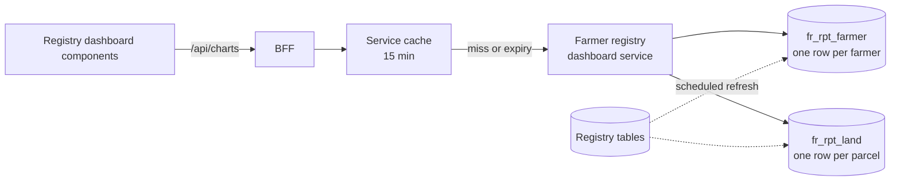

# Registry dashboard

The Registries dashboard presents live statistics from the OpenG2P farmer registry. This document
covers:

- where the figures come from
- the contract between the dashboard and the farmer registry's dashboard service
  ([farmer-registry-dashboard-api](https://github.com/Centre-for-Open-Societal-Systems/farmer-registry-dashboard-api))
- caching and freshness
- known limitations

## Data path

- **Reporting views.** The registry maintains two materialized views that roll the register up for
  reporting:
  - `fr_rpt_farmer` has one row per farmer, with land, crop, livestock, membership and demographic
    rollups.
  - `fr_rpt_land` has one row per parcel.

  Both unpack geography by position, so they are the same for any country, and both report areas in
  hectares.
- **Dashboard service.** The farmer registry's read-only dashboard service computes each chart as one parameterised aggregate query
  over those views. Its full contract is documented in its own repository, in
  `docs/api-reference.md`.
- **BFF cache.** The dashboards cache each chart and filter combination, as described below.

## Charts served from the registry

| Chart ID | Used in | Fields | Notes |
| --- | --- | --- | --- |
| `farmerKpis` | Key indicators, farm profile | `total_farmers, female_farmers, male_farmers, total_land_size, avg_farm_size, farmers_with_owned_land, household_heads, farmers_with_id, farmers_without_id` | `household_heads` is always 0 until the registry reports it |
| `farmersByRegion` | Farmers by region, map (national view) | `region, region_code, farmers` | `region_code` joins to map features |
| `farmersByZone`, `farmersByWoreda`, `farmersByKebele` | Map drill-down and list view; `farmersByWoreda` also drives Geographic Coverage | `zone`/`woreda`/`kebele`, `*_code`, `farmers` | Codes are administrative P-codes, matched **exactly** to map boundaries |
| `farmersByFarmerId` | Key indicators (with farmer ID) | `id_status, farmers` | From the registry's functional record id |
| `farmersByGender` | Demographic profile | `gender, farmers` | Codes: `MALE`, `FEMALE`, … |
| `farmersByType` | Farmers by farming type | `farming_type, farmers` | |
| `farmersByAgeAndGender` | Demographic profile, youth and elderly KPIs | `age_group, gender, farmers` | Bands `UNDER_25, 25_34, 35_49, 50_64, 65_PLUS, UNKNOWN`. The bands are registry policy, and the UI labels them |
| `farmersByEducation` | Education profile | `education, farmers` | |
| `farmersByRecordState` | Record status indicators | `record_state, farmers` | Covers every status |
| `landTenureSplit` | Land tenure (overview, crop, livestock) | `ownership_type, parcels, area` | Per parcel, for the parcels of the farmers matching the filters (a parcel lying outside its owner's area still counts under the owner's). Codes: `OWNER`, `TENANT`, `CROP_SHARE`, labelled in the UI |
| `registryTrendByMonth` | Registrations per month, registered vs owned area | `period (YYYY-MM), farmers, total_area, owned_area` | |
| `farmersByPsnpStatus`, `farmersByImportStatus` | Indicator tiles | always `[]` | No registry equivalent yet |

These chart IDs are declared for the `farmer-registry` entry of `DASHBOARD_SERVICES` in `server/dashboard-services.ts`.

### Codes and labels

The service returns registry **codes**. Labels are applied in one place,
`components/registry/registry-data.ts`:

- `AGE_BANDS` and `ageBandLabel()` for age bands, for example `UNDER_25` → "Under 25"
- `tenureLabel()` for tenure, for example `CROP_SHARE` → "Crop share"

Components must not re-bucket codes. If the registry changes its bands, only the label map changes.

## Filters

The sidebar filters map to service parameters as follows:

| Sidebar | Parameter | Behaviour |
| --- | --- | --- |
| Region / Zone / Woreda / Kebele | `region`, `zone`, `woreda`, `kebele` | Administrative codes (for example `ET04`). Clicking the map sets them too |
| Farming Type | `farmingType` | `crop` / `livestock` / `mixed`, matched case-insensitively. *Crop* and *Livestock* also switch to the dedicated registry view |
| Record Status | `recordState` | If not set, only **active** records are counted |
| Type of Farmer | `farmerType` | Not applied to registry charts |

## Map and geographic coverage

- **Map.** The national view colours regions from `farmersByRegion`. Drilling into a region, zone or
  woreda requests `farmersByZone`, `farmersByWoreda` or `farmersByKebele` with the same filters as
  the rest of the page, including record status. The map, the list view and the KPI cards therefore
  count the same farmers. Units are matched to boundary shapes by their exact P-code.
- **Geographic Coverage** is computed in the dashboard from two sources:
  - the **denominator** is the woredas of the map boundaries inside the selected region, zone or
    woreda, from `GET /api/maps/units`
  - the **numerator** is those woredas with at least one farmer in `farmersByWoreda`

  Coverage can therefore never disagree with the map. No national totals need to be configured.

## Caching and freshness

| Layer | Default | Effect |
| --- | --- | --- |
| Registry view refresh | hourly (registry setting) | Figures reflect the register as of the last refresh |
| Dashboards service cache | 15 minutes (`DASHBOARD_CACHE_TTL_SECONDS`) | Each chart and filter combination is fetched from the service at most once per period for each server process |

The worst-case lag between a change in the register and the dashboard is therefore the refresh
interval plus one cache period (about 75 minutes with the defaults). For a statistical overview this
is intended: it keeps load on the registry database constant, however many people view the
dashboard.

Behaviour:

- The unfiltered dashboard is pre-loaded when the server starts and refreshed every period, so it
  always opens from the cache.
- The first request for a filter combination waits for the service (typically well under a second).
  Requests after that are served from memory.
- After a period expires, viewers still get the previous figures instantly while a background
  refresh runs.
- If the service is unavailable, combinations already in the cache keep showing their last figures. New
  combinations show an error in the affected panels.

To force fresh figures, restart the dashboards server or wait one cache period.

## Known limitations

- **Crop and livestock views.** Their crop and livestock indicators, land statistics and the Crop
  view's map (hectares by zone and woreda) still query the transitional dashboard database. They show
  seeded reference data until they move to a dashboard service. The overview is served entirely by
  the farmer registry dashboard service.
- **Units the map cannot draw.** A few registry units are not in the map boundaries: special woredas
  whose hierarchy skips a level, and units created after the boundaries were published. They appear
  in the map's list view and the totals, but not as shapes.
- **Record status tiles.** The overview counts `approved`, `rejected` and `pending` records, but the
  registry uses a different status vocabulary (for example `ACTIVE`), so those tiles show 0.
- **Unavailable indicators.** The registry reporting views have no source yet for household heads,
  PSNP participation or legacy-import status.

